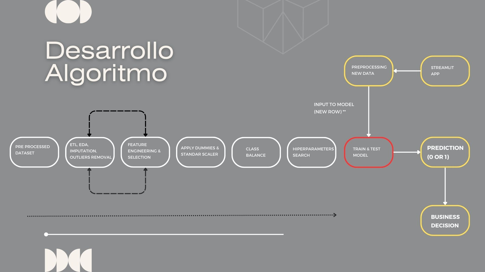

# SmartRisk: Aplicación web de detección de riesgo de incumplimiento de pago, en clientes que postulan a créditos.

### Industria o Rubro: Fintech

En un mundo empresarial cada vez más dinámico y competitivo, identificar y mitigar los riesgos financieros es crucial para mantener la estabilidad y el crecimiento de tu empresa. Por esto, hemos desarrollado una aplicación interactiva que utiliza de base, algoritmos de aprendizaje supervisado previamente entrenados para detectar de forma rápida y precisa a los clientes que representan un riesgo potencial para tu negocio de créditos. 

## Características principales

- **Análisis predictivo:** Utiliza algoritmos de aprendizaje supervisado para predecir el riesgo crediticio de los clientes.

- **Dashboard interactivo:** Visualiza el perfil del cliente basado en solicitudes anteriores, montos de créditos, antiguedad laboral, ingresos, valor de bienes y otras variables relevantes.

- **Efectividad comprobada:** Nuestro desarrollo cuenta con una efectividad de más del 85% para detectar clientes de alto riesgo, mejorando así la toma de decisiones financieras. 

*¡Únete a nosotros en el viaje hacia un futuro financiero más seguro y rentable!*

## Cómo empezar

Para utilizar nuestra aplicación, simplemente sigue estos pasos:

1. Ingresa al link: (https://....)
2. Dirígete a la página de análisis en la barra lateral para visualizar el dashboard.
3. Ingresa a la página de predicción y llena el formulario para evaluar un nuevo cliente.

## Desarrollo del proyecto

Nuestro enfoque se basa en la metodología CRISP-DM (Cross-Industry Standard Process for Data Mining), la cual consta de seis fases principales que guían el desarrollo de proyectos de minería de datos y análisis predictivo. En cada una de estas fases, llevamos a cabo tareas específicas para garantizar la efectividad y calidad de nuestro modelo predictivo de riesgo crediticio.

### Fases de la metodología CRISP-DM:

1. **Business Understanding:**
- Identificamos las variables críticas para el negocio que impactan en la predicción de riesgos de incumplimiento de pago. Además, analizamos cuidadosamente qué variables podrían introducir sesgo en el modelo para garantizar la imparcialidad y equidad en las decisiones predictivas.

2. **Data Understanding:** 
- Adquirimos el conjunto de datos de Kaggle, una plataforma reconocida por sus datos de alta calidad y diversidad. Se puede encontrar en el siguiente enlace: (https://www.kaggle.com/datasets/youngdaniel/loan-dataset/data?select=HC_DATA_description.txt)
- Realizamos un análisis exhaustivo de las variables relevantes para el objetivo del proyecto, extrayendo información clave a través de técnicas de análisis descriptivo.

3. **Data preparation:** 
- Procesamos los datos mediante técnicas de Extracción, Transformación y Carga (ETL, por sus siglas en inglés), centrándonos en la limpieza y transformación de datos numéricos y categóricos, eliminación de outliers y aplicación de pruebas de hipótesis para reducir la dimensionalidad y mejorar la calidad de los datos.

4. **Modeling:** 
- Seleccionamos y entrenamos diversos algoritmos de aprendizaje supervisado. Además, aplicamos diferentes técnicas para optimizar el rendimiento de los modelos como balanceo de clases, análisis de componentes principales (PCA) y búsqueda de hiperparámetros.

5. **Evaluation:**
- Evaluamos el desempeño del modelo utilizando métricas estándar para problemas de clasificación binaria, como la matriz de confusión, F1-Score, precisión, recall, accuracy y las curvas ROC-AUC y PR-AUC. 
- Nuestro enfoque se centra en la reducción de errores de tipo 2, donde el modelo clasifica erróneamente a un cliente riesgoso como no riesgoso.

6. **Deployment:**
- Desarrollamos una aplicación interactiva conectada con los algoritmos previamente entrenados, permitiendo al cliente ingresar nuevas solicitudes y obtener predicciones en tiempo real sobre el riesgo crediticio asociado a cada cliente. 

## ¿Por qué CRISP-DM?
La metodología CRISP-DM proporciona un marco estructurado y sistemático para el desarrollo de proyectos de minería de datos y análisis predictivo. Al seguir esta metodología, aseguramos un enfoque paso a paso que abarca desde la comprensión del negocio hasta la implementación efectiva de soluciones predictivas, garantizando así resultados confiables y de alta calidad para nuestros clientes.

## Créditos: 

Contribuyeron a este proyecto:

- **Gustavo Cevallos** (Data Analyst) - [Linkedin](https://www.linkedin.com/in/gustavocevallosp/). [Github](https://github.com/gustavocevallos)
    - Análisis exploratorio de datos.
    - Desarrollo de dashboard con visualizaciones interactivas.
    - Elaboración de informes y documentación técnica.

- **Laura Gutierrez** (Data Scientist) - [Linkedin](https://www.linkedin.com/in/lauridangut/). [Github](https://github.com/lauridangut)
    - Análisis exploratorio de datos y preprocesamiento.
    - Análisis estadístico de variables numéricas.
    - Investigación y desarrollo de algoritmos de machine learning.

- **Giuseppe Navarro Marín** (Data Scientist) - [Linkedin](https://www.linkedin.com/in/gnavarromarin/). [Github](https://github.com/gnavarromarin)
    - Diseño de estrategia de análisis predictivo.
    - Análisis exploratorio de datos y preprocesamiento
    - Análisis estadístico de variables categóricas.
    - Investigación y desarrollo de algoritmos de machine learning.

- **Joaquin Vásquez Calizaya** (Software Developer) - [Linkedin](https://www.linkedin.com/in/joaquin-vasquez-calizaya/). [Github](https://github.com/imjowend)
    - Desarrollo de la infraestructura de software y herramientas de automatización.
    - Implementación de integraciones externas y pruebas de integración.

Además, agradecemos a Miriam Sarli por su contribución en los inicios de este proyecto y a nuestro Team Leader, Oscar Toledo, por guiarnos en cada paso.

## Tecnologías utilizadas

Este proyecto se ha desarrollado utilizando las siguientes tecnologías y herramientas:

- **Python:** Utilizado como lenguaje principal de programación.
  - Librerías: Pandas, Numpy, Matplotlib, Seaborn, Scikit-Learn, Imblearn, Scipy.

- **IDE (Entorno de Desarrollo Integrado):** Se han utilizado Jupyter Notebooks y VSCode como entornos de desarrollo.
  
- **Power BI:** Utilizado para la visualización de datos con DAX.

- **Streamlit:** Utilizado para la creación de la aplicación web interactiva.

- **GitHub:** Utilizado para la gestión del código fuente y la colaboración en equipo.
